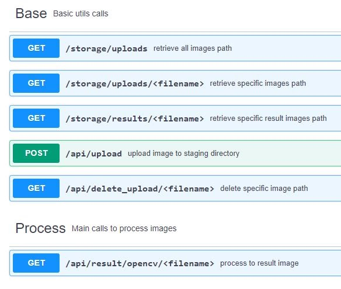

# API and Web App for Lymphoblast Counter

This repository contains documentation about API and Web Apps Configuration for Lymphoblast Server (Image Classification).
All sources are developed by using Flask Framework.

There are two main repo inside folder /apps; API and dashboard

################################################################

### API ---- this contains API configuration.

** For development **

- build environment
- activate environment
- use latest python and pip version for runtime
- run "pip install -r requirements_model_new.txt"
- make sure that your model checkpoint also included in /API/api/Tensorflow/workspace/models
- run "python run.py"

------------------- For heroku deployment -----------------------

- read instructions on /API/heroku.txt

------------------- For gcp deployment --------------------------

- jump into gcp terminal or gcloud cli, setup gcp account and select project
- for build image use "docker build -t flaskapi -f Dockerfile . "
- try to run docker image locally using "docker run -d -it flaskapi", reassure that the instances is run properly
- then push to container registry by using "docker push flaskapi"
- select docker image from container registry and deploy on cloud run, "gcloud run deploy flaskapi-v1 --image flaskapi --region $your_nearest_region --memory 128Mi"
- instance with tag flaskapi-v1 is created

another deployment method

- jump into gcp terminal or gcloud cli, setup gcp account and select project
- mkdir new foler, git clone from your repo
- run on menu debug cloud run emulator, configure service name etc etc, if it's good then
- run on menu deploy to cloud run, select service, gcp project, etc ect. finish.

################################################################

## dashboard ---- this contains Web App configuration.

This application is supported by open source dashboard config app-seed.

------------------- For development -----------------------------

- build environment
- activate environment
- use latest python and pip version for runtime
- run "pip install -r requirements.txt"
- read instructions at /dashboard/command.txt

------------------- For heroku deployment -----------------------

- follow instruction on heroku deployment with git

################################################################

## Attachment

### Propose Scheme

### List of API Endpoints

Web Apps Demo (https://youtu.be/SNL4r8WSQws)
